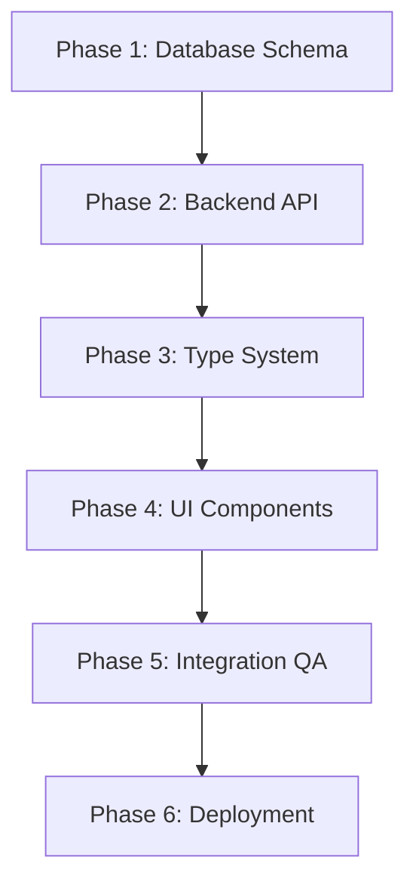

# Multi-Selection Questions Implementation Plan (Sequential Workflow)

## Overview
This document outlines a sequential workflow implementation plan for adding multi-selection question support to the Java Test Application. Each phase completes its work and passes clear outputs to the next phase.

## Current System Analysis

### Limitations
- Frontend uses radio buttons (single selection only)
- Answer storage supports only single string values
- Database schema stores single correct answer
- Validation logic expects single correct answer
- Documentation explicitly states single-choice only

## Sequential Workflow Implementation

### Phase 1: Database Schema Updates

**Objective**: Analyze and update database schema for multi-selection support

**Input**: 
- Current database schema (`java_test.db`)
- Existing question data structure
- Requirements specification for multi-selection questions

**Work Tasks**:
1. Reset the database to no questions
2. Analyze current `questions` table structure
3. Identify questions with comma-separated correct answers
4. Create database backup
5. Add `question_type` column (default: 'single')
6. Validate migration success
7. generate a `question.csv` file with 10 sample questions to test multi-selection logic

**Output Deliverables**:
- `database-migration.sql` - Migration script
- **Handoff Data**: Updated database schema with `question_type` field

**Completion Criteria**:
- [ ] All existing questions remain functional
- [ ] New `question_type` field added successfully
- [ ] Multi-answer questions identified and tagged
- [ ] Database backup created and validated
- [ ] Zero data loss during migration

**Validation Commands**:
```bash
# Verify schema changes
sqlite3 java_test.db ".schema questions"
# Count question types
sqlite3 java_test.db "SELECT question_type, COUNT(*) FROM questions GROUP BY question_type"
# Validate data integrity
sqlite3 java_test.db "SELECT COUNT(*) FROM questions WHERE correct_answer IS NOT NULL"
```

---

### Phase 2: Backend API Updates

**Objective**: Update backend services to support multi-selection question logic

**Input**: 
- Updated database schema from Phase 1
- Current API endpoints documentation
- Answer validation requirements

**Work Tasks**:
1. update the csv import logic to handle multi-selection questions
2. import `question-test.csv` file with sample questions
3. Design new API response format for multi-selection questions
4. Update question model interfaces
5. Implement multi-selection answer validation logic
6. Update scoring algorithm to handle arrays
7. Modify question retrieval endpoints
8. Update answer submission endpoints
9. Add question type filtering capabilities

**Output Deliverables**:
- `api-specification.json` - Updated API documentation
- `validation-service.js` - New validation logic
- `question-model-updates.js` - Updated data models
- `endpoint-tests.js` - API endpoint tests
- `backend-integration-tests.js` - Full backend tests
- **Handoff Data**: Updated API specification and validation rules

**Completion Criteria**:
- [ ] API returns both single and multi-selection questions correctly
- [ ] Answer validation works for both question types
- [ ] Backward compatibility maintained for existing API calls
- [ ] All tests pass with 100% coverage
- [ ] Performance benchmarks met

**API Response Format Example**:
```json
{
  "id": 1,
  "question": "Select all valid Java keywords:",
  "options": [
    {"key": "A", "text": "class"},
    {"key": "B", "text": "interface"},
    {"key": "C", "text": "goto"},
    {"key": "D", "text": "const"}
  ],
  "correct_answer": ["A", "B"],
  "question_type": "multiple",
  "max_selections": 2
}
```

**Validation Commands**:
```bash
# Test API endpoints
npm test -- --testPathPattern=api.test.js
# Run integration tests
npm run test:integration
# Performance benchmark
npm run benchmark:api
```

---

### Phase 3: Frontend Type System Updates

**Objective**: Update TypeScript interfaces and type system for multi-selection support

**Input**: 
- Backend API specification from Phase 2
- Current frontend type definitions
- Component interface requirements

**Work Tasks**:
1. Update `Question` interface to support both formats
2. Modify `Answer` interface for array support
3. Add new `QuestionType` enum and related types
4. Update state management to handle answer arrays
5. Modify answer selection logic
6. Add validation for selection limits

**Output Deliverables**:
- `types/index.ts` - Updated type definitions
- `types/question.ts` - Question-specific types
- `types/answer.ts` - Answer-specific types
- `state/quiz-state.ts` - Updated state management
- `type-validation-tests.ts` - Type system tests
- **Handoff Data**: Updated TypeScript interfaces and state management

**Type Definition Example**:
```typescript
export interface Question {
  id: number;
  question: string;
  options: Option[];
  correct_answer: string | string[]; // Support both formats
  question_type: 'single' | 'multiple';
  max_selections?: number;
}

export interface Answer {
  questionId: number;
  selectedAnswer: string | string[]; // Support both formats
}
```

**Completion Criteria**:
- [ ] All TypeScript compilation errors resolved
- [ ] Type safety maintained for both question types
- [ ] State management handles arrays correctly
- [ ] Type tests pass with 100% coverage
- [ ] IDE intellisense works correctly

**Validation Commands**:
```bash
# Type checking
npm run type-check
# Run type-specific tests
npm test -- --testPathPattern=types
# Build verification
npm run build
```

---

### Phase 4: UI Component Implementation

**Objective**: Implement multi-selection UI components and interactions

**Input**: 
- Updated type definitions from Phase 3
- UI/UX design specifications
- Accessibility requirements

**Work Tasks**:
1. Implement conditional rendering (radio vs checkbox)
2. Add selection limit enforcement
3. Create visual indicators for question types
4. Update answer review components
5. Add multi-selection result display
6. Implement partial correctness indicators
7. Ensure ARIA labels are correct
8. Add keyboard navigation support
9. Test screen reader compatibility

**Output Deliverables**:
- `components/Quiz.tsx` - Updated quiz component
- `components/QuestionDisplay.tsx` - Enhanced question display
- `components/AnswerReview.tsx` - Updated answer review
- `components/MultiSelectOption.tsx` - New checkbox component
- `ui-component-tests.tsx` - Component tests
- `accessibility-report.md` - Accessibility audit results
- **Handoff Data**: Fully functional multi-selection UI components

**Completion Criteria**:
- [ ] Conditional rendering works correctly
- [ ] Selection limits enforced properly
- [ ] Visual indicators clear and consistent
- [ ] Accessibility standards met (WCAG 2.1 AA)
- [ ] All component tests pass
- [ ] Cross-browser compatibility verified

**Validation Commands**:
```bash
# Component tests
npm test -- --testPathPattern=components
# Accessibility audit
npm run audit:a11y
# Visual regression tests
npm run test:visual
```

---

### Phase 5: Integration & Quality Assurance

**Objective**: Ensure end-to-end functionality and system integration

**Input**: 
- All deliverables from Phases 1-4
- Test scenarios and acceptance criteria
- Performance requirements

**Work Tasks**:
1. Execute end-to-end test scenarios
2. Verify database-to-UI data flow
3. Test mixed question type scenarios
4. Benchmark application performance
5. Test with large datasets
6. Verify memory usage patterns
7. Conduct usability testing scenarios
8. Validate user workflows
9. Test error handling and edge cases

**Output Deliverables**:
- `e2e-test-results.html` - End-to-end test report
- `performance-benchmark-report.md` - Performance analysis
- `usability-test-report.md` - UX testing results
- `integration-test-suite.js` - Comprehensive test suite
- `quality-assurance-checklist.md` - QA validation checklist
- **Handoff Data**: Validated and tested complete system

**Completion Criteria**:
- [ ] All end-to-end scenarios pass
- [ ] Performance within acceptable limits
- [ ] No usability issues identified
- [ ] Error handling works correctly
- [ ] Data integrity maintained throughout

**Validation Commands**:
```bash
# End-to-end tests
npm run test:e2e
# Performance tests
npm run test:performance
# Full test suite
npm run test:all
```

---

### Phase 6: Deployment & Monitoring

**Objective**: Deploy changes and establish monitoring

**Input**: 
- Validated system from Phase 5
- Production deployment requirements
- Monitoring and alerting specifications

**Work Tasks**:
1. Update the rules for creating questions `question-generation-rules.md` to take into account multi-selection as an option too.

**Output Deliverables**:
- `question-generation-rules.md` - documentation
- **Final Output**: Production-ready multi-selection feature

**Completion Criteria**:
- [ ] Production deployment successful
- [ ] Feature flags operational
- [ ] Monitoring systems active
- [ ] Documentation complete and accurate
- [ ] Rollback procedures tested


## Sequential Workflow Orchestration

### Phase Dependencies


## Phase Success Metrics

### Quantitative Metrics
- **Phase 1**: Zero data loss, 100% schema migration success
- **Phase 2**: API response time < 200ms, 100% test coverage
- **Phase 3**: Zero TypeScript errors, 100% type safety
- **Phase 4**: WCAG 2.1 AA compliance, 100% component test coverage
- **Phase 5**: 100% E2E test pass rate, performance within 10% baseline
- **Phase 6**: Zero deployment failures, 99.9% uptime post-deployment

### Qualitative Metrics
- Code maintainability and readability
- User experience improvements
- System reliability and stability
- Documentation completeness

### Manual Intervention Triggers
- Two consecutive validation failures
- Performance degradation > 25%
- Critical security issues detected
- User-reported blocking issues

## Monitoring & Observability

### System Health Indicators
- Database query performance
- API endpoint response times
- Frontend component render times
- User interaction success rates
- Error rates by component

## Implementation Notes

### Phase Handoff Best Practices
1. **Clear Documentation**: Each phase documents outputs clearly
2. **Validation Gates**: No phase proceeds without validation
3. **Artifact Management**: All deliverables versioned and tracked
4. **Communication**: Structured handoff meetings between phases

### Quality Gates
- **Phase 1**: Database integrity validation
- **Phase 2**: API contract validation
- **Phase 3**: Type safety validation
- **Phase 4**: Accessibility compliance validation
- **Phase 5**: End-to-end functionality validation
- **Phase 6**: Production readiness validation

---

## Phase Execution Checklist

### Pre-Phase Preparation
- [ ] Input requirements validated
- [ ] Dependencies confirmed available
- [ ] Team resources allocated
- [ ] Validation criteria defined

### During Phase Execution
- [ ] Regular progress updates
- [ ] Deliverable quality checks
- [ ] Validation commands executed
- [ ] Issues documented and resolved

### Post-Phase Completion
- [ ] All completion criteria met
- [ ] Handoff data prepared
- [ ] Next phase briefed
